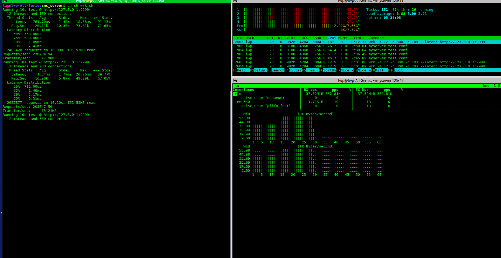

# README #

## 简介

```
 __  __                _  __   ____
|  \/  |_   _ ___  ___| |/ _| / ___|  ___ _ ____   _____ _ __
| |\/| | | | / __|/ _ \ | |_  \___ \ / _ \ '__\ \ / / _ \ '__|
| |  | | |_| \__ \  __/ |  _|  ___) |  __/ |   \ V /  __/ |
|_|  |_|\__, |___/\___|_|_|   |____/ \___|_|    \_/ \___|_|
        |___/
```

ms_server 即 `MySelf Server`，是在学习 nginx 的过程中为了好玩而开发的 tcp server 框架。
参考并改造了 redis 的事件模型 `eventloop`，参考并改造了 nginx 的定时器 `timer`。

## 功能

提供了下列功能：

* 解析配置文件
* 支持多进程
* 支持后台运行
* 记录访问日志
* 记录错误日志
* 支持 epoll
* 使用红黑树实现了定时器，支持超时控制
* 支持信号处理(日志切割、快速退出)

## 使用

**编译 & 安装**

``` sh
make
make install // 安装到 /usr/sbin/ 目录下
```

**运行**

确保配置文件中设置的路径可以访问。

``` sh
myserver test.conf
```

**访问**

默认为 echo server。

``` sh
curl "http://127.0.0.1:9999"
```

``` sh
GET / HTTP/1.1
Host: 127.0.0.1:9999
User-Agent: curl/7.47.0
Accept: */*

```

**日志切割**

``` sh
sh sh-reopen.sh
```

**快速退出**

```sh
sh sh-stop.sh
```

**性能压测**

``` sh
sh sh-wrk.sh
```



在 4 核 CPU，8 G 内存的台式机上压测，QPS 可以达到 23.8W+。

## 个人定制

修改 ms_server_test.c 中 ms_server_proce_handler() 函数的实现，可自定义 server 功能。

```
conn->rebuff   : 为接收缓冲区。
recvlen        : 为接收缓冲区有效数据的长度。

conn->sebuff  : 为发送缓冲区。
conn->sendsize: 为待发送数据的长度。
```

注意：conn->rebuff 与 conn->sebuff 的容量由 MS_MAX_BUF_SIZE 宏定义，默认为 4096。
单次发送或接收的数据若大于 MS_MAX_BUF_SIZE - 1 则认为恶意攻击，断开连接。

## BUG

本项目仅仅为了学习 nginx 而模仿 nginx 开发的 training project，必有不严谨之处，如有 bug 欢迎反馈。
